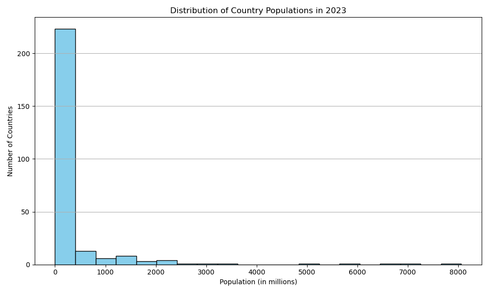

# SCT_DS_01
Visualization of global population using histogram(world Bank Data)
# 📊 Skillcraft Internship - Task 1

This task is part of the Skillcraft Technology internship. It involves analyzing world population data for 2023 and visualizing the distribution using a histogram.

---

## 📁 Files Included
| `task1.ipynb` | Jupyter Notebook containing code to clean, analyze, and plot the population data |

| `taskone.png` | Final histogram image output |

| `README.md` | Project description and submission info |

---

## 🧪 Libraries Used
- `pandas`
- `matplotlib.pyplot`

---

## 📸 Output Preview

---

## 🔗 Dataset Source
- World Bank: [https://data.worldbank.org](https://data.worldbank.org)
